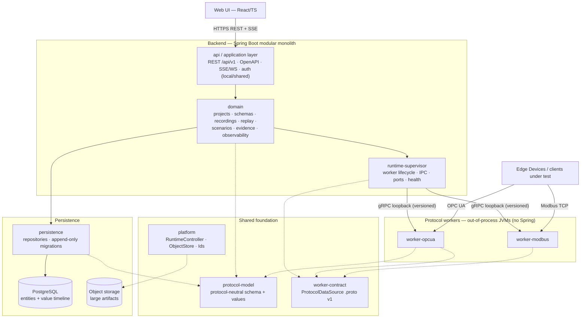
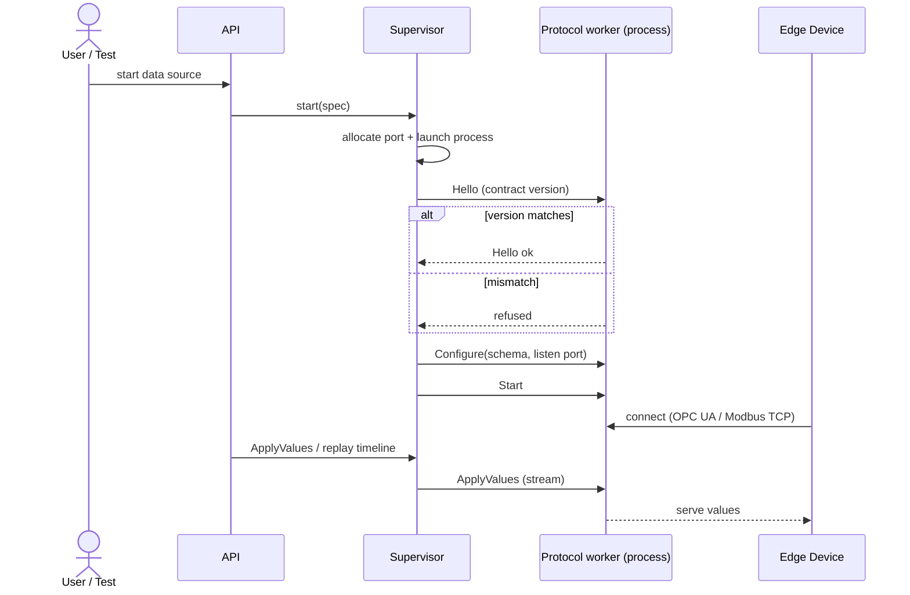

# Architecture

Change rule: do not change this file without explicit user approval. Propose
changes first with rationale and expected impact.

Scope: a high-level map of the system — its modules, runtime model, and the
binding constraints every developer-agent must follow. Deliberately brief; no
implementation detail. Product capabilities live in `openspec/specs/`
(capability-by-capability); UI structure/UX rules in
`openspec/specs/frontend-shell/spec.md`; approved technology stack in
`STACK.md`; glossary in `MEMORY.md`. Rationale and prior ADRs live in git
history.

## System overview

A modular monolith: a Java + Spring Boot backend with a React/TypeScript Web UI.
The backend hosts the domain modules and a runtime supervisor. The supervisor
runs each protocol data-source as an isolated, out-of-process worker, so one
worker crash cannot take down the backend. A single protocol-neutral schema,
native type-definition, and value model is the source of truth; each worker
projects it onto its native protocol address model. Persistence is split by data shape: a relational store
holds entities and value timelines, with an object-storage abstraction for large
artifacts. The core risk is a reliable simulator runtime — fidelity, fault
isolation, determinism, and reproducible evidence rank above CRUD convenience.

## Module map

Dependencies flow downward; lower modules never depend on higher ones. Protocol
and runtime modules must not depend on UI-facing modules. Solid arrows =
runtime/data flow; dotted = compile-time dependency on the shared foundation.
The concrete Gradle modules behind these layers are listed in
[`README.md`](README.md#module-map).

## Runtime model

- The supervisor owns all worker lifecycle (start/stop, health, restart, port
  allocation, resource governance) and stays protocol-agnostic.
- Every worker implements one `ProtocolDataSource` contract. Adding a protocol
  means adding a worker, not changing the supervisor.
- Workers are lightweight and independent of the backend framework, so many can
  run concurrently.
- Supervisor⇄worker IPC is local-only (loopback) and versioned, never exposed
  externally; mismatched contract versions are refused, not tolerated.
- Faults are a product feature, tagged by intent: intentional faults are never
  auto-healed; only unexpected failures trigger restart-with-backoff. Faults
  exist at both the protocol-neutral and protocol-specific layers, mapped per
  worker.

How the supervisor brings a worker up and feeds it values:

## Data and persistence

- The protocol-neutral model, including imported native type definitions, is the
  single source of truth. Recording, replay, synthetic generation, scenarios,
  and faults operate only on it — never per-protocol. A worker must reject an
  unmaterializable native type explicitly rather than coercing its declaration
  or value.
- Recordings are scoped to a protocol type, not to the data source instance they
  were captured from; replay/import binds to any compatible data source of that
  type at run time, never at capture/import time.
- Two separate data paths: the recording path captures every value change (no
  sampling); the live path is conflated/throttled for the UI.
- Determinism is guaranteed for generated value content and scenario step
  ordering (explicit clock, seeded random) — not for client delivery timing.
- Persistence is chosen by data shape: the relational store holds both entities and
  value timelines. Value timelines use append-optimized tables (batched writes with
  backpressure; time-ordered range reads for replay and evidence) — no specialized
  time-series engine required. Object storage holds large artifacts; no large blobs
  in the relational store.
- Runtime events and user-activity audit are distinct, separately recorded
  streams.

## APIs and live updates

- REST + OpenAPI for commands, queries, and test-control (so automated tests can
  drive runs).
- SSE/WebSocket for live state and values.
- Path-based major API versioning; additive within a major version.

## Security and deployment modes

- Two deployment modes from one build: trusted local (single user, auth optional)
  and shared team (multi-user, authenticated). Runs on Linux, Windows, and macOS.
  The database connection is externally configured, so either mode can target a
  containerized Postgres with a mounted volume or a managed instance (e.g. RDS).
- Shared mode authenticates via external identity providers (OAuth2/OIDC) and
  authorizes by roles (admin, user); the API layer enforces authorization.
- Shared edits use optimistic concurrency — no silent overwrites; other users see
  a read-only view while an item is being edited.
- Secrets and PKI material come from env vars / an external secret store, never
  from repo files. Exportable/importable artifacts are versioned and exclude
  secrets and private keys; newer-than-supported versions fail safely.

## Governance

- No new dependency without explicit approval; use only the approved stack in
  `STACK.md`.
- No new base class or generic abstraction without written approval. The
  protocol-neutral model and the `ProtocolDataSource` worker contract are the
  approved abstractions.
- Architectural boundaries (do not cross without approval): no microservices
  split before scale or ownership boundaries require it; no Kubernetes as the
  baseline deploy target; no second primary database; no plaintext secrets.
