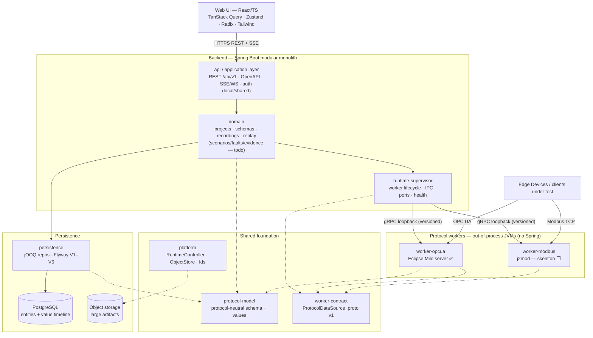
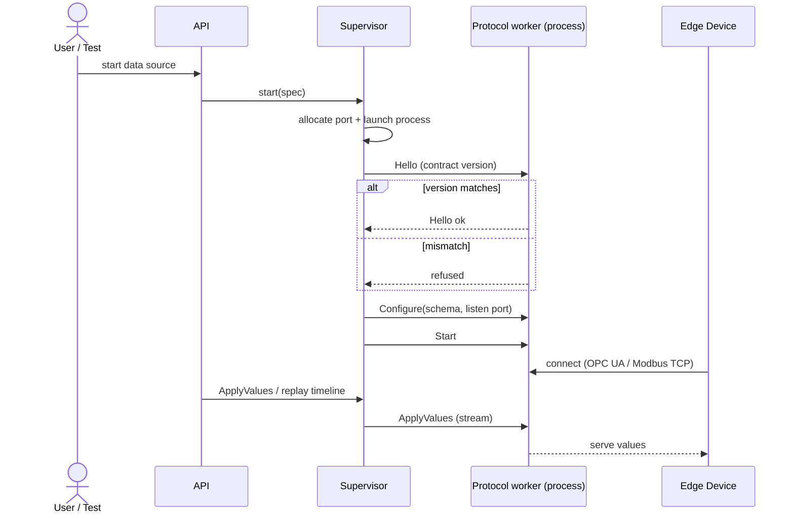

# Architecture Diagram

Brief visual companion to `ARCHITECTURE.md` (which stays the source of truth).
Status markers (✅ done · 🟡 partial · ⬜ todo) reflect the current snapshot from
`backend-specs/TASKS.md`; the text in `ARCHITECTURE.md` defines the binding
constraints.

## Module map

Dependencies flow downward only; protocol/runtime modules never depend on
UI-facing modules. Solid arrows = runtime/data flow; dotted arrows = compile-time
dependency on the shared foundation.

## Worker lifecycle / IPC

How the supervisor brings a protocol worker up out-of-process and feeds it
values. IPC is loopback-only and versioned; a contract mismatch is refused, not
tolerated.

